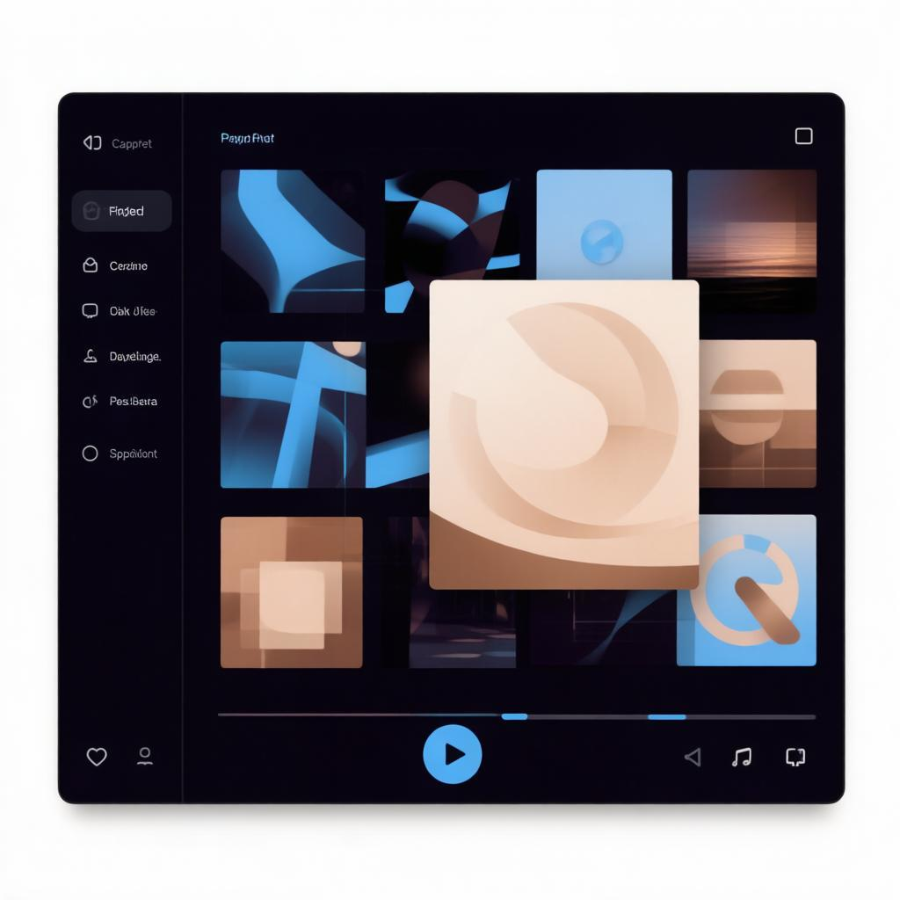
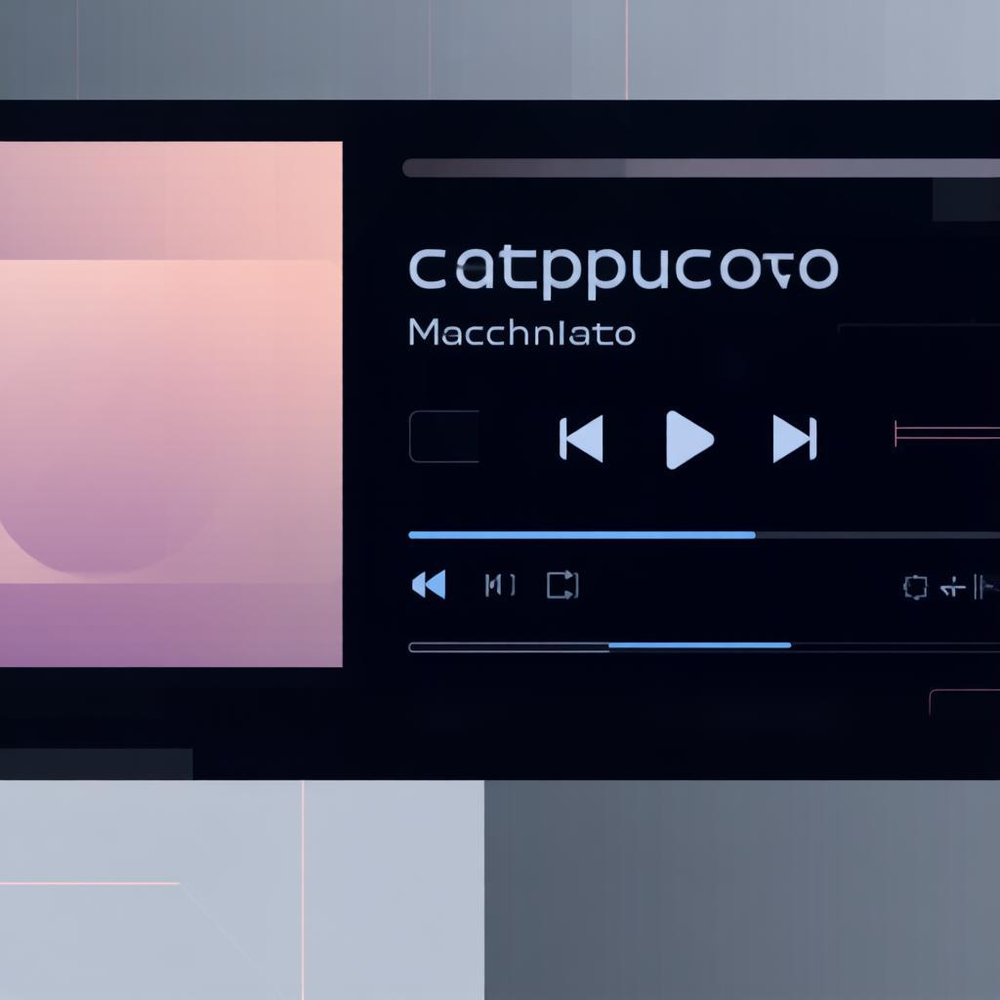
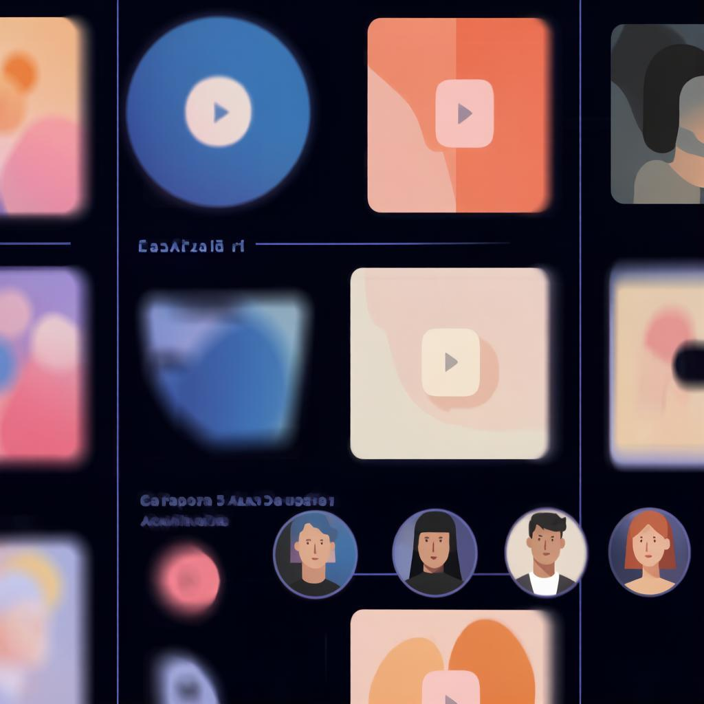

<div align="center">

# 🎧 YaMusic

**Независимый desktop-клиент Яндекс Музыки**

Построен на C++17 · Qt 6 · QML · macOS, Linux и Windows

</div>

---

## Скриншоты

<div align="center">

|             Главная             |             Сейчас играет              |             Медиатека             |
| :-----------------------------: | :------------------------------------: | :------------------------------: |
|  |  |  |

</div>

---

## Возможности

### Авторизация

* Авторизация через OAuth Яндекс Музыки
* Получение OAuth-ссылки непосредственно из приложения
* Ввод полученной ссылки в приложение
* Сохранение авторизации между запусками
* Выход из аккаунта

### Музыка и поиск

* Поиск музыки
* «Моя волна»
* Персональные рекомендации
* Персональные плейлисты
* Недавно прослушанные треки
* Пользовательские плейлисты
* Понравившиеся треки
* Сохранённые альбомы
* Любимые исполнители
* Новые релизы
* Чарты России и мира
* Жанры
* Страницы жанров
* Страницы плейлистов
* Страницы альбомов
* Страницы исполнителей

### Воспроизведение

* Единая очередь воспроизведения
* Добавление и удаление треков
* Изменение порядка треков
* Автоматический переход к следующему треку
* Repeat (Off / One / All)
* Shuffle
* **Автопереход на похожий контент** при окончании очереди
* **Подсветка текущего трека** во всех списках
* Управление громкостью
* Mini Player
* Expanded Now Playing
* Прогресс воспроизведения и перемотка
* Dynamic Player Accent

### Текст песен (Lyrics)

* 🎤 Загрузка текста песни с сервера
* Отдельный полноэкранный просмотр
* Автоматическая загрузка при нажатии на кнопку

### Интерфейс

* Верхняя навигация
* Боковая панель
* Контекстная панель
* Единый стиль страниц
* Тёмная цветовая схема Catppuccin (Latte / Macchiato)
* **Переключение темы с сохранением в настройках**
* **Попап настроек** (тема + выход)
* Адаптивное расположение основных областей интерфейса

---

## Установка

Для обычного использования рекомендуется использовать готовые пакеты YaMusic.

Готовые пакеты будут содержать необходимые Qt runtime-библиотеки и QML-модули, поэтому отдельная установка Qt для запуска приложения не потребуется.

### Windows

Будет доступен установщик:

```text
YaMusic-<version>-windows-x64.exe
```

### macOS

Будет доступен пакет:

```text
YaMusic-<version>-macos.dmg
```

После установки приложение запускается как обычное macOS-приложение.

### Linux

Будет доступен AppImage:

```text
YaMusic-<version>-linux-x86_64.AppImage
```

Запуск:

```bash
chmod +x YaMusic-*.AppImage
./YaMusic-*.AppImage
```

---

## Авторизация

Для авторизации в YaMusic:

1. Нажмите кнопку получения OAuth-ссылки в приложении.
2. Откройте полученную ссылку в браузере.
3. Авторизуйтесь в аккаунте Яндекса и разрешите доступ.
4. После авторизации скопируйте полученную ссылку из адресной строки браузера.
5. Вставьте ссылку обратно в YaMusic.

YaMusic автоматически извлечёт необходимые данные из ссылки и выполнит авторизацию.

После успешной авторизации данные сохраняются, поэтому повторно проходить эту процедуру при каждом запуске не требуется.

### Безопасность

Ссылку, полученную после авторизации, **не следует передавать другим людям или публиковать**, поскольку она содержит данные для доступа к вашему аккаунту.

Не публикуйте её:

* в GitHub;
* в исходном коде;
* в скриншотах;
* в логах;
* в открытых конфигурационных файлах.

---

## Сборка из исходников

Для сборки необходимы:

* C++17 compiler
* Qt 6
* Qt Quick
* Qt Multimedia
* CMake
* Ninja

`CMakeLists.txt` является источником истины для конфигурации проекта.

### Linux

Установите необходимые зависимости для своего дистрибутива.

**Ubuntu:**

```bash
sudo apt update

sudo apt install \
    build-essential \
    cmake \
    ninja-build \
    qt6-base-dev \
    qt6-declarative-dev \
    qt6-multimedia-dev
```

**Arch Linux:**

```bash
sudo pacman -S --needed \
    base-devel \
    cmake \
    ninja \
    qt6-base \
    qt6-declarative \
    qt6-multimedia
```

После установки зависимостей сборка одинакова для Ubuntu и Arch Linux.

Клонирование проекта:

```bash
git clone https://github.com/andfriden/YaMusic.git
cd YaMusic
```

Конфигурация:

```bash
cmake -S . -B build
```

Сборка:

```bash
cmake --build build --parallel
```

Запуск:

```bash
./build/appYaMusic
```

### macOS

Необходимы:

* Xcode / Apple Clang
* Qt 6
* CMake
* Ninja

Клонирование проекта:

```bash
git clone https://github.com/andfriden/YaMusic.git
cd YaMusic
```

Конфигурация:

```bash
cmake -S . -B build
```

Сборка:

```bash
cmake --build build --parallel
```

Запуск:

```bash
./build/appYaMusic.app/Contents/MacOS/appYaMusic
```

### Windows

Необходимы:

* Visual Studio 2022 с C++ workload
* Qt 6
* CMake
* Ninja или Visual Studio generator

Клонирование проекта:

```powershell
git clone https://github.com/andfriden/YaMusic.git
cd YaMusic
```

Конфигурация:

```powershell
cmake -S . -B build
```

Сборка:

```powershell
cmake --build build --config Debug
```

Запуск:

```powershell
.\build\Debug\appYaMusic.exe
```

### Установка собранного приложения

После сборки приложение можно установить в отдельный каталог:

```bash
cmake --install build --prefix dist
```

Команда установки использует правила, определённые в `CMakeLists.txt`.

---

## Архитектура

YaMusic построен с разделением логики приложения и пользовательского интерфейса.

```text
QML
 │
 ▼
Controllers
 │
 ▼
Services / Models
 │
 ├── Yandex Music API
 │
 └── Playback
```

### C++

C++ отвечает за:

* бизнес-логику;
* работу с API;
* авторизацию;
* модели данных;
* состояние приложения;
* воспроизведение;
* очередь воспроизведения.

### QML

QML отвечает за:

* пользовательский интерфейс;
* страницы;
* навигацию;
* визуальное состояние;
* взаимодействие пользователя с приложением.

### Controllers

Основные контроллеры:

* `AppController`
* `AlbumController`
* `ArtistController`
* `ChartController`
* `GenreController`
* `LibraryController`
* `PersonalController`
* `PlaybackController`
* `SearchController`

### Services

Services инкапсулируют работу с API Яндекс Музыки и отдельными подсистемами приложения.

### Playback

Воспроизведение построено на Qt Multimedia.

Основные компоненты:

* `PlaybackController`
* `PlayerService`
* `QueueService`
* `QueueModel`

`PlayerService` отвечает за управление `QMediaPlayer`.

`QueueService` управляет очередью воспроизведения.

`PlaybackController` связывает состояние воспроизведения с остальной частью приложения.

---

## Интерфейс

Основной интерфейс YaMusic состоит из:

* верхней навигации;
* боковой панели;
* центральной области контента;
* контекстной панели;
* Mini Player.

Основные разделы:

* Моя волна
* Чарты
* Жанры
* Плейлисты
* Спорт
* Медиатека (Мне нравится):

  * Понравившиеся треки
  * Сохранённые альбомы
  * Любимые исполнители
  * Пользовательские плейлисты

Страницы альбомов, исполнителей, плейлистов и жанров открываются внутри основной области приложения.

---

## Структура проекта

```text
YaMusic/
├── src/
│   ├── Core/
│   ├── Models/
│   ├── Playback/
│   ├── Player/
│   ├── Queue/
│   └── Yandex/
│
├── qml/
│   ├── Components/
│   ├── Home/
│   ├── Layout/
│   ├── MyWave/
│   ├── Pages/
│   ├── Search/
│   └── Theme/
│
├── data/
│   └── genre_playlists.csv
│
├── CMakeLists.txt
├── main.cpp
└── README.md
```

---

## Roadmap

### v0.1 — Technical POC

* [x] Базовое Qt-приложение
* [x] Подключение к Yandex Music API
* [x] Авторизация
* [x] Базовое воспроизведение

### v0.2 — Search

* [x] Поиск
* [x] Результаты поиска
* [x] Работа с треками
* [x] Страницы альбомов
* [x] Страницы исполнителей

### v0.3 — My Wave / Personal

* [x] «Моя волна»
* [x] Персональные рекомендации
* [x] Недавно прослушанные
* [x] Персональные плейлисты

### v0.4 — Smart Queue & Playback

* [x] Единая очередь
* [x] Добавление и удаление треков
* [x] Изменение порядка
* [x] Автоматический переход к следующему треку
* [x] Repeat
* [x] Shuffle
* [x] Несколько источников воспроизведения

### v0.5 — Library & Playlists

* [x] Пользовательские плейлисты
* [x] Страницы плейлистов
* [x] Библиотека
* [x] Недавно прослушанные

### v0.6 — Likes

* [x] Понравившиеся треки
* [x] Работа с лайками
* [x] Удаление лайков

### v0.7 — Playback Polish / Now Playing

* [x] Mini Player
* [x] Expanded Now Playing
* [x] Управление прогрессом
* [x] Перемотка
* [x] Управление громкостью
* [x] Dynamic Player Accent

### v0.8 — Catalog & Library Expansion ✅

#### Catalog

* [x] Чарты
* [x] Жанры
* [x] Страницы жанров
* [x] Страницы плейлистов
* [x] Новые релизы (на главной странице)

#### Library

* [x] Пользовательские плейлисты
* [x] Понравившиеся треки
* [x] Недавно прослушанные треки
* [x] Сохранённые альбомы
* [x] Любимые исполнители

#### Playback

* [x] Автопереход на похожий контент при окончании очереди
* [x] Подсветка текущего трека во всех списках

#### UI

* [x] Переключение тёмной темы
* [x] Попап настроек вместо кнопки «Выйти»

### v0.9 — Lyrics ✅

* [x] Загрузка текста через `GET /tracks/{id}/supplement`
* [x] Метод `loadSupplementary()` в TrackService
* [x] Показ синхронизированных строк (подсветка текущей + автопрокрутка)
* [x] Показ обычного текста без таймингов
* [x] Кнопка 🎤 в Now Playing / панель текста в ExpandedNowPlaying

### v0.10 — System Media Controls 🚧

* [ ] MPRIS на Linux (метаданные + управление)
* [ ] SMTC на Windows (System Media Transport Controls)
* [ ] MPRemoteCommandCenter на macOS
* [ ] Обновление метаданных now playing (трек, исполнитель, обложка)
* [ ] Управление воспроизведением: play/pause, next/prev, seek

---

## Disclaimer

YaMusic — независимый неофициальный клиент Яндекс Музыки.

Проект не является официальным продуктом Яндекса и не связан с компанией Яндекс.

Для работы приложения используется API Яндекс Музыки.

---

## Лицензия

Проект распространяется на условиях лицензии, указанной в репозитории.

---

[⬆ Наверх](#yamusic)

